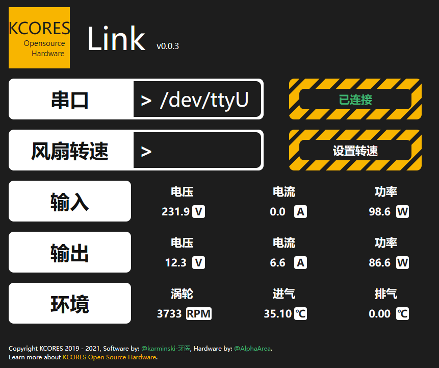

KCORES Link
-----------




# 描述

该 KCORES Link 软件是为 KCORES CSPS to ATX Converter (CSPS转ATX转换器) 而编写的软件界面, 通过接入串口通信读取CSPS输出的信息, 最终实时展示到WEB界面上.  


# 下载并运行

访问[Release页面](https://github.com/Izumiko/kcores-link/releases)，按操作系统下载对应版本。

若想手动编译，则在下载源代码后，在`src`目录运行如下命令：

```shell
go build -o ../
```

# Author

- [Karminski-牙医](https://github.com/karminski)

# License

[KCORES License 1.0](./license)